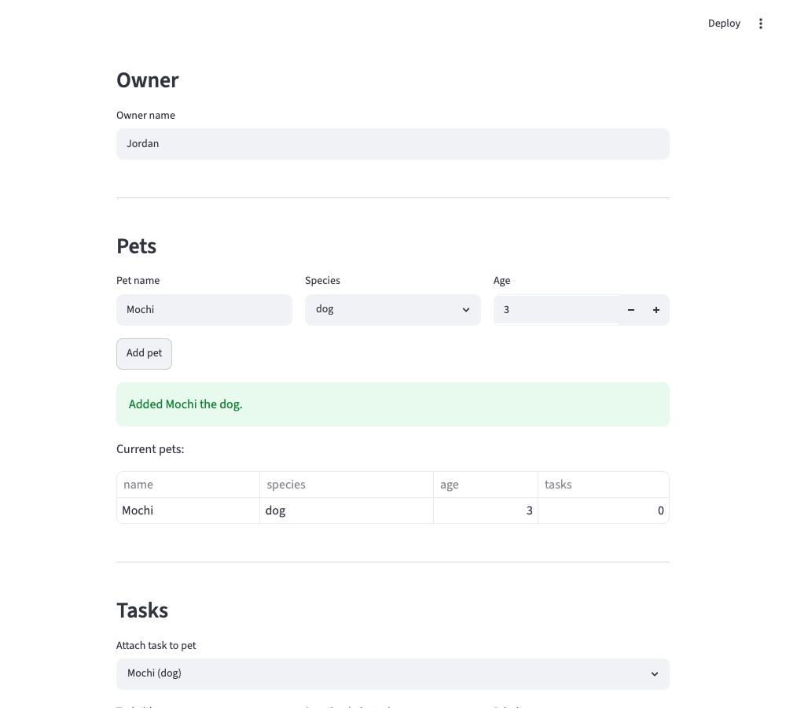
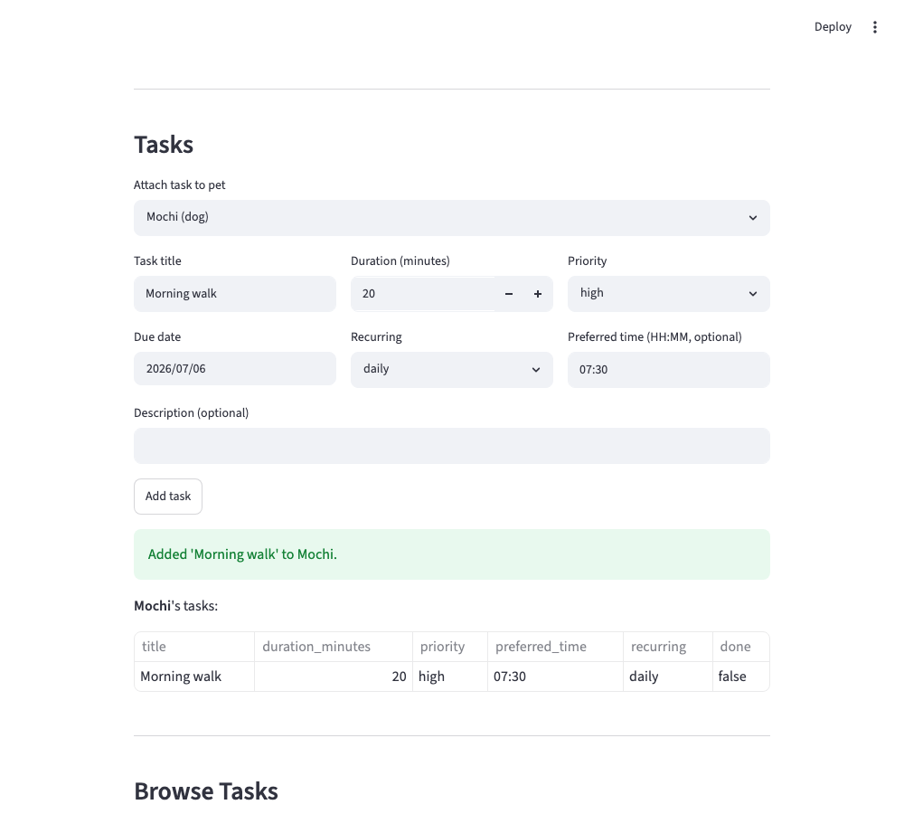
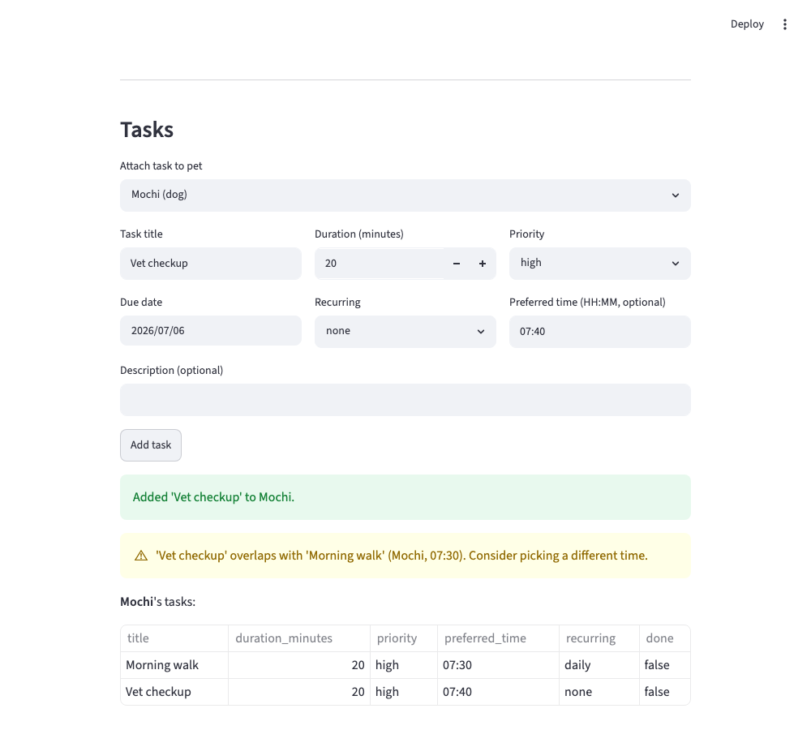
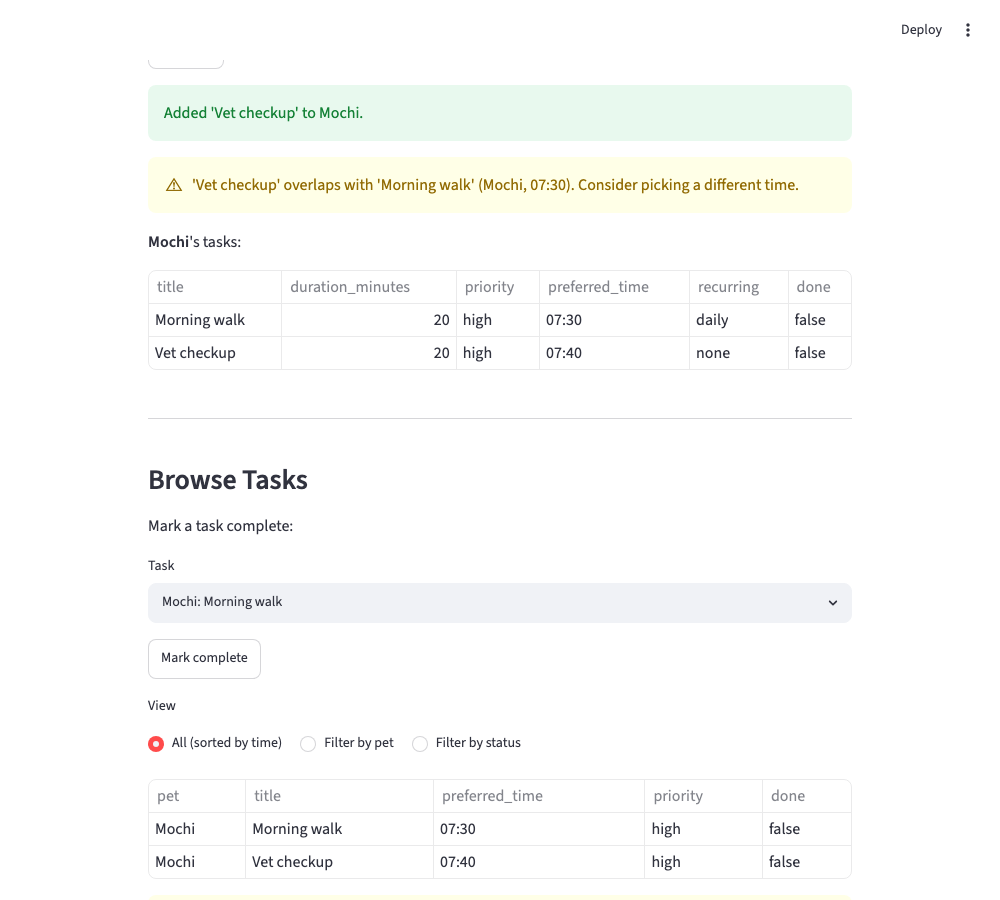
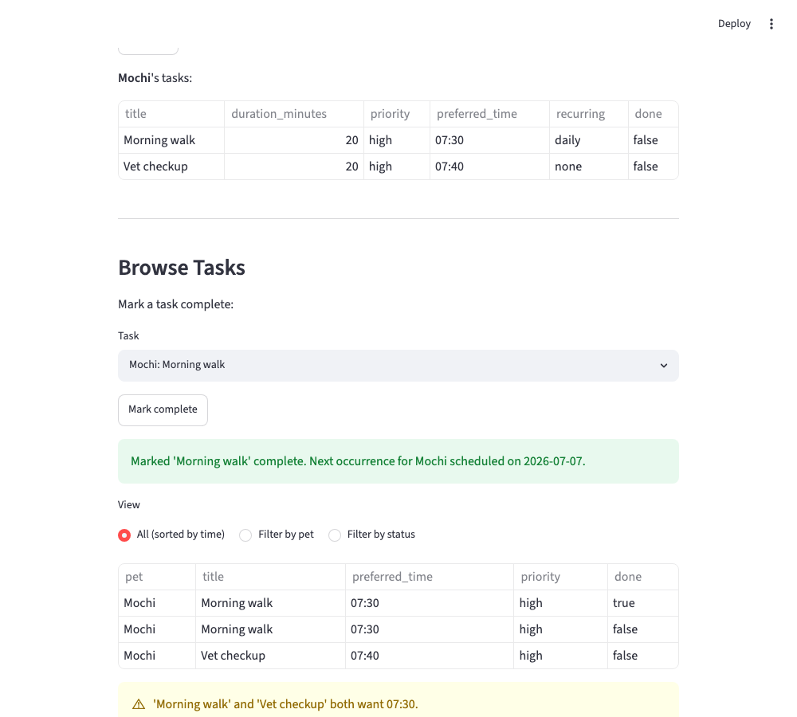
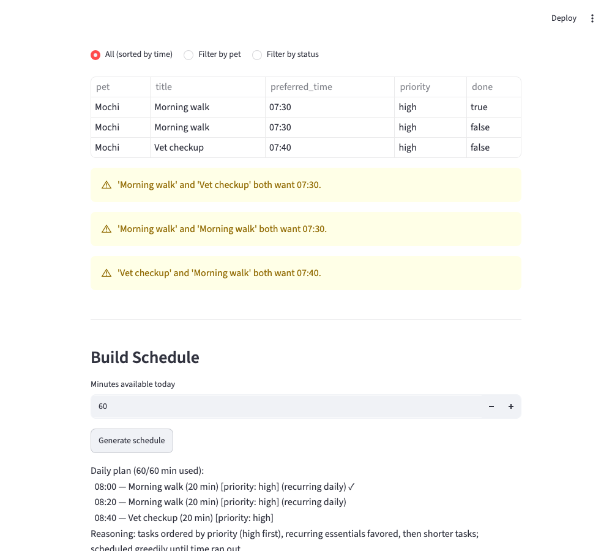

# PawPal+ (Module 2 Project)

You are building **PawPal+**, a Streamlit app that helps a pet owner plan care tasks for their pet.

## Scenario

A busy pet owner needs help staying consistent with pet care. They want an assistant that can:

- Track pet care tasks (walks, feeding, meds, enrichment, grooming, etc.)
- Consider constraints (time available, priority, owner preferences)
- Produce a daily plan and explain why it chose that plan

Your job is to design the system first (UML), then implement the logic in Python, then connect it to the Streamlit UI.

## What you will build

Your final app should:

- Let a user enter basic owner + pet info
- Let a user add/edit tasks (duration + priority at minimum)
- Generate a daily schedule/plan based on constraints and priorities
- Display the plan clearly (and ideally explain the reasoning)
- Include tests for the most important scheduling behaviors

## ✨ Features

- **Priority-based scheduling** — tasks are ordered by priority (high → low), then recurring tasks, then shorter duration as a tie-break, so the most urgent care is packed into the day first.
- **Sorting by time** — view the full task list chronologically by preferred time of day, with untimed ("flexible") tasks sorted last.
- **Filtering** — narrow the pooled task list by pet, by completion status, or both at once.
- **Conflict warnings** — overlapping preferred-time ranges are flagged immediately when a task is added, and again in the browse view, so a collision is never a surprise.
- **Daily/weekly recurrence** — completing a recurring task automatically schedules its next occurrence on the same pet, guarded against double-scheduling.
- **Greedy time-budget scheduling** — the daily plan packs as many priority-ordered tasks as fit within the owner's available minutes, and explains what was scheduled, what was skipped, and why.
- **Input validation** — priority, recurrence, and preferred-time values are validated and normalized (e.g., `"HIGH"` → `"high"`, `"7:30"` → `"07:30"`) so a typo raises an error instead of silently degrading into a wrong-but-plausible default.

## Getting started

### Setup

```bash
python -m venv .venv
source .venv/bin/activate  # Windows: .venv\Scripts\activate
pip install -r requirements.txt
```

### Suggested workflow

1. Read the scenario carefully and identify requirements and edge cases.
2. Draft a UML diagram (classes, attributes, methods, relationships).
3. Convert UML into Python class stubs (no logic yet).
4. Implement scheduling logic in small increments.
5. Add tests to verify key behaviors.
6. Connect your logic to the Streamlit UI in `app.py`.
7. Refine UML so it matches what you actually built.

## 🖥️ Sample Output

Running the demo script exercises the logic layer end to end and prints a daily plan
built across all of the owner's pets:

```bash
python main.py
```

```
----------------------------------------------------
All tasks sorted by preferred time:
  07:30    Morning walk     [Mochi]
  08:00    Feeding          [Whiskers]
  08:15    Litter box       [Whiskers]
  14:00    Grooming         [Mochi]
  17:30    Playtime         [Whiskers]
----------------------------------------------------
Filtered — Whiskers' tasks:
  Playtime         [Whiskers] (not done)
  Litter box       [Whiskers] (done)
  Feeding          [Whiskers] (done)
----------------------------------------------------
Filtered — completed tasks:
  Litter box       [Whiskers] (done)
  Feeding          [Whiskers] (done)
====================================================
      🐾 PawPal+ — Today's Schedule for Jordan       
====================================================
Pets: Mochi (dog), Whiskers (cat)
----------------------------------------------------
  08:00  Feeding           10 min  [high]  (daily, done)
  08:10  Morning walk      30 min  [high]  (daily)
  08:40  Litter box         5 min  [medium]  (daily, done)
  08:45  Playtime          15 min  [medium]
----------------------------------------------------
Skipped (not enough time today):
  • Grooming          45 min  [low]
----------------------------------------------------
Summary: 4 task(s) scheduled, 60/60 minutes used.
====================================================
----------------------------------------------------
Recurrence automation:
  Completed 'Morning walk' — Mochi now has 3 task(s) (was 2).
  Next occurrence scheduled: 'Morning walk' due 2026-07-07.
----------------------------------------------------
Conflict check:
  ⚠ 'Morning walk' and 'Morning walk' both want 07:30.
```

## 🧪 Testing PawPal+

```bash
# Run the full test suite:
python -m pytest

# Run with coverage:
pytest --cov
```

Sample test output:

```
============================= test session starts ==============================
platform darwin -- Python 3.12.12, pytest-9.1.1, pluggy-1.6.0
rootdir: /Users/benjaminshutman/Codepath x Anthropic Summer 2026/Codepath-x-Anthropic/ai110-module2show-pawpal-starter
plugins: anyio-4.14.1
collected 30 items

tests/test_pawpal.py ..............................                      [100%]

============================== 30 passed in 0.02s ===============================
```

**Test coverage:**

- **Input validation** — `preferred_time` is normalized to zero-padded `"HH:MM"` (e.g. `"7:30"` → `"07:30"`); `priority` and `recurring` are validated case-insensitively against their allowed sets (e.g. `"HIGH"` → `"high"`). Malformed values for any of the three raise `ValueError` at construction time instead of silently degrading (a bad priority would otherwise quietly get the lowest weight; a bad recurring value would otherwise quietly never recur).
- **Task completion** — `mark_complete()` flips `completion_status` from `False` to `True`.
- **Task addition** — adding tasks to a `Pet` increases its task count.
- **Recurring automation** — completing a `daily`/`weekly` task creates a correctly-dated next occurrence on the same pet; completing a non-recurring task creates nothing; completing an already-completed task a second time doesn't duplicate the next occurrence.
- **Conflict detection** — tasks whose `[preferred_time, preferred_time + duration)` ranges overlap are flagged, even at different start times; back-to-back tasks that only touch, tasks with no preferred time, and an empty task list never conflict.
- **Sorting** — `sort_by_time()` orders tasks chronologically by `preferred_time`, with flexible (no-time) tasks sorted last and ties/all-flexible lists keeping their original order (stable sort).
- **Filtering** — `filter_tasks()` narrows a pooled task list by pet name, by completion status, or both at once; unmatched filters and empty input return an empty list.
- **Greedy scheduling** — `build_schedule()` schedules tasks that fit the time budget and skips the rest, including the exact-fit boundary, a zero-minute budget, an empty task list, and wrapping the clock past midnight.

**Confidence Level:** ⭐⭐⭐⭐⭐ (5/5)

All 30 tests pass, covering every algorithmic feature's happy path plus real edge cases (empty lists, ties, exact-fit boundaries, midnight wraparound, double-completion, malformed input) — and writing the edge cases actually caught a real bug (`mark_task_complete()` could double-schedule a recurring task before a guard was added). I'd initially marked this 5/5 right after closing the conflict-detection and `preferred_time`-validation gaps, but on reflection that was premature: `priority` and `recurring` had the exact same unvalidated-string vulnerability `preferred_time` did (a typo silently degrading to a wrong-but-plausible default instead of raising), just not yet fixed. All three fields are now validated the same way, so the 5/5 reflects that every gap I've found so far is actually closed and tested, not just the first two. One small, deliberately-accepted limitation remains: conflict overlap checks don't span midnight (a task at "23:50" isn't checked against next-day tasks) — see `reflection.md` §2b for why that's an acceptable tradeoff for a daily pet-care scheduler.

## 🧩 System Design

PawPal+ is built around four classes:

- **`Owner`** — the pet owner using the app. Holds their name, preferences, and the list of `Pet`s they manage. `get_all_tasks()` pools every pet's tasks into one flat list so the `Scheduler` can plan across all of an owner's pets at once.
- **`Pet`** — a single pet (name, species, age) and its list of `Task`s. `add_task()` stamps each task with the pet's name so a pooled task list can still be traced back to which pet it belongs to.
- **`Task`** — one care task: title, description, duration, priority, due date, recurrence (`"none"`/`"daily"`/`"weekly"`), an optional preferred time of day, and completion status. A task controls its own state — `mark_complete()` is the only way to flip `completion_status`, and `next_occurrence()` builds the task's next instance if it recurs.
- **`Scheduler`** — takes a pool of tasks and a daily time budget. It can sort tasks (by priority or by time), filter them (by pet or status), detect basic scheduling conflicts, mark a task complete (auto-scheduling its next occurrence if it recurs), and greedily build/explain a day's plan that fits the available time.

## 📐 Smarter Scheduling

| Feature | Method(s) | Notes |
|---------|-----------|-------|
| Priority sorting | `Scheduler.sort_tasks()`, `Task.get_priority_value()` | Orders by priority (high→low), then recurring tasks, then shorter duration as a tie-break so more tasks fit the day. |
| Sorting behavior | `Scheduler.sort_by_time()` | Orders tasks by `preferred_time` ("HH:MM"); tasks with no preferred time are flexible and sort last. |
| Filtering behavior | `Scheduler.filter_tasks()` | Filters a task list by pet name and/or completion status, independently or together. |
| Conflict detection logic | `Scheduler.detect_conflicts()` | Flags any pair of tasks whose `[preferred_time, preferred_time + duration)` ranges truly overlap, even at different start times. Compares within a single day only — see `reflection.md` section 2b for that remaining tradeoff. |
| Recurring task logic | `Task.next_occurrence()`, `Scheduler.mark_task_complete()` | Completing a `daily`/`weekly` task automatically creates and attaches its next occurrence (due one interval past today) to the same pet. Guards against double-completion creating a duplicate occurrence. |
| Greedy scheduling | `Scheduler.build_schedule()` | Packs the priority-sorted list into the day sequentially, skipping any task that doesn't fit the remaining `available_minutes`. |
| Input validation | `Task.__post_init__()` | Normalizes `preferred_time` (`"7:30"` → `"07:30"`), `priority`, and `recurring` (case-insensitive) and raises `ValueError` on anything outside their allowed values, so `app.py` can catch it and show `st.error()` instead of a typo silently degrading into a wrong-but-plausible weight or behavior. |

## 📸 Demo Walkthrough

A reviewer can follow these steps in the running Streamlit app (`streamlit run app.py`) to see every algorithmic feature in action — no video required.

**Main UI features — what a user can do:**

- Enter owner info and add one or more pets (name, species, age)
- Add care tasks to a pet (title, duration, priority, due date, recurrence, optional preferred time)
- Browse the pooled task list sorted by time, or filtered by pet / completion status
- See overlapping-time conflicts flagged the moment a task is added, and again while browsing
- Mark a task complete — a recurring task automatically schedules its next occurrence
- Build a daily schedule from a time budget and read the plain-English explanation of what was scheduled, what was skipped, and why

**Example workflow:**

1. Enter the owner's name, then add a pet (e.g., "Mochi", dog, age 3).

   

2. Add a task to that pet — e.g., "Morning walk," 20 minutes, high priority, recurring `daily`, preferred time `07:30`.

   

3. Add a second, overlapping task (e.g., "Vet checkup" at `07:40`) — a conflict warning appears immediately: `⚠ 'Vet checkup' overlaps with 'Morning walk' (Mochi, 07:30). Consider picking a different time.`

   

4. Open **Browse Tasks** to see the pooled task list sorted by time, or filter it down to just this pet's tasks or just the completed ones.

   

5. Mark "Morning walk" complete — since it's a `daily` recurring task, its next occurrence is automatically scheduled for tomorrow on the same pet (and the conflict check still catches that the new occurrence collides with "Vet checkup").

   

6. Set "Minutes available today" and click **Generate schedule** to see today's plan: which tasks were scheduled (in priority + time order), which were skipped for lack of time, and the reasoning behind the ordering.

   

**Key Scheduler behaviors shown along the way:**

- Priority + duration sorting (`sort_tasks`) drives the order tasks are packed into the schedule
- Time-based sorting (`sort_by_time`) orders the Browse Tasks view chronologically
- Filtering (`filter_tasks`) narrows the pooled list by pet and/or completion status
- Overlap-aware conflict detection (`detect_conflicts`) flags colliding preferred times, both on add and while browsing
- Recurrence automation (`Task.next_occurrence`, `mark_task_complete`) reschedules daily/weekly tasks without manual re-entry
- Greedy time-budget scheduling (`build_schedule`) fits as many tasks as possible into the available minutes

**Sample CLI output** — running the same logic layer end to end via `python main.py` produces:

```
----------------------------------------------------
All tasks sorted by preferred time:
  07:30    Morning walk     [Mochi]
  08:00    Feeding          [Whiskers]
  08:15    Litter box       [Whiskers]
  14:00    Grooming         [Mochi]
  17:30    Playtime         [Whiskers]
----------------------------------------------------
Filtered — Whiskers' tasks:
  Playtime         [Whiskers] (not done)
  Litter box       [Whiskers] (done)
  Feeding          [Whiskers] (done)
----------------------------------------------------
Filtered — completed tasks:
  Litter box       [Whiskers] (done)
  Feeding          [Whiskers] (done)
====================================================
      🐾 PawPal+ — Today's Schedule for Jordan       
====================================================
Pets: Mochi (dog), Whiskers (cat)
----------------------------------------------------
  08:00  Feeding           10 min  [high]  (daily, done)
  08:10  Morning walk      30 min  [high]  (daily)
  08:40  Litter box         5 min  [medium]  (daily, done)
  08:45  Playtime          15 min  [medium]
----------------------------------------------------
Skipped (not enough time today):
  • Grooming          45 min  [low]
----------------------------------------------------
Summary: 4 task(s) scheduled, 60/60 minutes used.
====================================================
----------------------------------------------------
Recurrence automation:
  Completed 'Morning walk' — Mochi now has 3 task(s) (was 2).
  Next occurrence scheduled: 'Morning walk' due 2026-07-07.
----------------------------------------------------
Conflict check:
  ⚠ 'Morning walk' and 'Morning walk' both want 07:30.
```

Screenshots above were captured from the running Streamlit app (`screenshots/`); a video isn't included since the text + images fully cover the flow.
